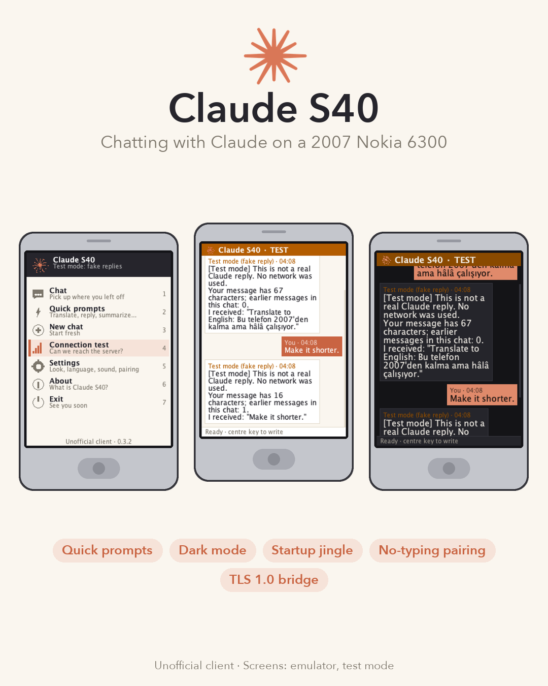
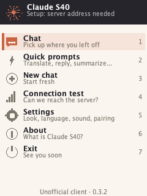
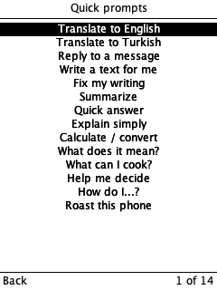
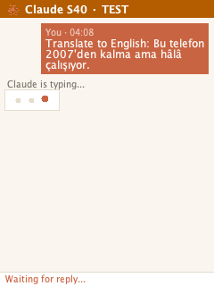
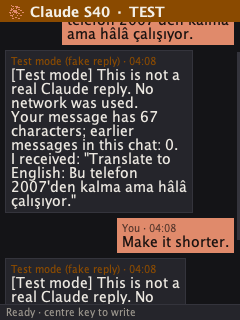

# Claude S40

**Chat with Claude on a 2007 Nokia.** An unofficial Claude client for Nokia
Series 40 phones (Java ME), plus the small server it talks to.



| Home | Quick prompts | Waiting for Claude | Dark mode, large text |
|---|---|---|---|
|  |  |  |  |

Start-up animation: [docs/images/splash.gif](docs/images/splash.gif). Screens are from the
FreeJ2ME emulator in the app's test mode.

> Unofficial side project. Not made, endorsed or supported by Anthropic or
> Nokia. See [TRADEMARKS.md](TRADEMARKS.md).

Tested on a **Nokia 6300 (RM-217, firmware V06.60)**. Other Series 40
phones (CLDC 1.1 / MIDP 2.0, 240x320) may work but are untested.

## How it works

```
Nokia (Java ME app) --HTTPS: TLS 1.0, RSA, no SNI, cert from YOUR private CA--> claude-s40-server --HTTPS--> Claude API
                                                                                     |
                                                                              SQLite (Docker volume)
```

A 2007 phone cannot speak modern HTTPS: the Nokia 6300 offers only TLS 1.0
with RSA key exchange, sends no SNI, and its root store stops around 2008.
Public clouds (including Cloudflare) refuse that handshake. So the server
terminates TLS itself with a certificate from a private root CA that you
put on the phone once. Details and measurements: [docs/ARCHITECTURE.md](docs/ARCHITECTURE.md).

## What's inside

| Path | What |
|---|---|
| [`app/`](app/) | The phone app: CLDC 1.1 / MIDP 2.0 MIDlet, ~52 KB JAR, English + Turkish UI, splash + jingle, chat bubbles, quick prompts, dark mode, pairing without typing a long code. Reproducible build with 42 package checks. |
| [`server/`](server/) | One Go binary / Docker image (~7 MB): phone-facing TLS, chat backend (official `anthropic-sdk-go`), SQLite, pairing, admin API bound to localhost. |
| [`docs/`](docs/) | [SETUP.md](docs/SETUP.md) (step by step), [ARCHITECTURE.md](docs/ARCHITECTURE.md) (protocol, TLS, design). |

## Quick start

Full guide: **[docs/SETUP.md](docs/SETUP.md)**. In short:

1. A Docker host with a public IPv4 and TCP 443 (a $4-6/month VPS is enough).
2. `server/scripts/pki.sh ca ~/.config/claude-s40/pki` and
   `server/scripts/pki.sh server ~/.config/claude-s40/pki <server-ip>`.
3. `server/deploy/push.sh root@<server-ip> --execute` (starts in test mode, no API cost).
4. `echo GATEWAY_URL=https://<server-ip> > app/app.local.properties && make -C app`,
   then install `app/dist/ClaudeS40.jad/.jar` on the phone.
5. Put the root CA on the phone (`server/deploy/serve-ca.sh`, compare the fingerprint).
6. On the phone: Connection test → Settings → Pair this phone →
   `server/deploy/admin.sh root@<server-ip> pair <code>`.
7. `server/deploy/set-key.sh root@<server-ip>` and
   `S40_MOCK=0 server/deploy/push.sh root@<server-ip> --execute` to go live.

## Development

```
make test          # server: go vet + go test -race; app: build + 42 checks + reproducibility
make -C app        # phone app only (downloads pinned build tools to app/.deps)
make -C server test
```

Requirements: Go 1.26+, JDK 11+, Python 3 with Pillow, Docker (for
deployment), OpenSSL or LibreSSL.

## Privacy and cost

- The Claude API key lives only on your server. The phone gets a per-device,
  revocable access token through pairing.
- Chats are stored on your server for 30 days after the last message; no
  chat history is kept on the phone. Logs contain no message text.
- Every message is a Claude API call billed to your key. The server enforces
  per-device daily request and output-token limits and never retries a paid
  call automatically. Set a spending limit in the Claude Console.

## License

MIT, see [LICENSE](LICENSE). Build-time tools are downloaded, not bundled
(ECJ: EPL-2.0, ProGuard: GPL-2.0, MicroEmulator API stubs: LGPL); none of
them end up in the phone app. The optional emulator harness
`app/emu/EmuShot.java` links against FreeJ2ME (GPL-3.0), which is not
included.
